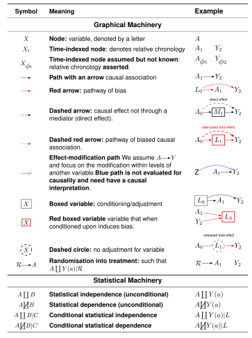
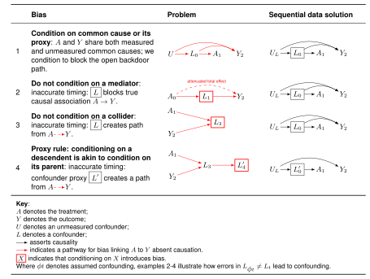

# Week 2: Causal Diagrams — Five Elementary Structures

```admonish note title="Readings"
- Barrett M (2023). *ggdag: Analyze and Create Elegant Directed Acyclic Graphs.* R package version 0.2.7.9000. <https://github.com/malcolmbarrett/ggdag>
- "An Introduction to Directed Acyclic Graphs": <https://r-causal.github.io/ggdag/articles/intro-to-dags.html>
- "Common Structures of Bias": <https://r-causal.github.io/ggdag/articles/bias-structures.html>
```

```admonish warning title="Key concepts for the test(s)"
- **Confounding**
- **Causal Directed Acyclic Graph**
- **Five elementary causal structures**
- **d-separation**
- **Back door path**
- **Conditioning**
- **Fork bias**
- **Collider bias**
- **Mediator bias**
- **Four rules of confounding control**
```

```admonish tip title="Download your lab R script"
1. Create a new `.R` file called `02-lab.R` with your name, contact, date, and a title such as "Simulating the five basic causal structures in R."
2. Copy and paste the code chunks below during class.
3. Save in a clearly defined project directory.

You may also download the lab here: [Download the R script for Lab 02](https://raw.githubusercontent.com/go-bayes/psych-434-2025/refs/heads/main/laboratory/02-lab.R)
```

---

## Seminar

### Overview

- Understand basic features of causal diagrams: definitions and applications
- Introduction to the five elementary causal structures
- Lab: gentle introduction to simulation and regression

### Review

1. Psychological research begins with two questions:

> 1. What do I want to know?
> 2. For which population does this knowledge generalise?

This course considers how to ask psychological questions that pertain to populations with different characteristics.

2. In psychological research, we typically ask questions about the causes and consequences of thought and behaviour: "What if?" questions (Hernán & Robins, 2024).

3. The following concepts help us describe two distinct failure modes:

- **External validity:** the extent to which findings generalise to other situations, people, settings, and time periods. We want to know if our findings carry beyond the *sample population* to the *target population*. We fail when our results do not generalise as we think, or when we have not clearly defined our question or target population.

- **Internal validity:** the extent to which the associations we obtain from data reflect causality. When asking "What if?" questions, we want to understand what would happen if we intervened. In this course, we use "treatment" or "exposure" to denote the intervention, and "outcome" to denote the effect of an intervention.

4. During the first part of the course, our primary focus is on challenges to internal validity from **confounding bias.**

## Definitions

**Internal validity** is compromised if the association between the treatment and outcome in a study does not consistently reflect causality in the sample population as defined at baseline.

**External validity** is compromised if the association between the treatment and outcome in a study does not consistently reflect causality in the target population as defined at baseline.

**Confounding bias** exists if there is an open back-door path between the treatment and outcome, or if the path between the treatment and outcome is blocked.

Today, our purpose is to clarify the meaning of each term in this definition. To that end, we introduce the five elementary graphical structures employed in causal diagrams, then explain the four elementary rules that allow investigators to identify causal effects from the asserted relations in a causal diagram.

## Introduction to Causal Diagrams

Causal diagrams (also called causal graphs, Directed Acyclic Graphs, or Causal DAGs) are graphical tools whose primary purpose is to enable investigators to detect confounding biases.

**Remarkably, causal diagrams are rarely used in psychology!**

### The meaning of our symbols


For us:

- $X$ denotes a variable without reference to its role.
- $A$ denotes the "treatment" or "exposure" variable: the variable for which we seek to understand the effect of intervening on it. It is the "cause."
- $Y$ denotes the outcome or response of an intervention. It is the "effect."
- $Y(a)$ denotes the counterfactual or potential state of $Y$ in response to setting the level of the exposure to $A = a$. To consistently estimate causal effects we need to evaluate counterfactual states of the world. This might seem like science fiction, but we are already familiar with methods for obtaining such contrasts: randomised controlled experiments.
- $L$ denotes a measured confounder or set of confounders: a variable which, if conditioned upon, closes an open back-door path between $A$ and $Y$.
- $U$ denotes an unmeasured confounder: a variable that may affect both the treatment and the outcome but for which we have no direct measurement.
- $M$ denotes a mediator: a variable along the path from exposure to outcome. Conditioning on a mediator when estimating the total effect of $A$ on $Y$ will bias that estimate.
- $\bar{X}$ denotes a sequence of variables, for example a sequence of treatments.
- $\mathcal{R}$ denotes a randomisation or a chance event.

### Elements of our causal graphs



#### Time indexing

In our causal diagrams, we implement two conventions for temporal order. First, the layout is structured left to right to reflect the sequence of causality. Second, we index nodes according to the relative timing of events. If $X_0$ precedes $X_1$, the indexing indicates this chronological order.

#### Representing uncertainty in timing

When the sequence of events is ambiguous (particularly in cross-sectional data), we use $X_{\phi t}$ to propose a temporal order without clear time-specific measurements. We denote an event presumed to occur first as $X_{\phi 0}$ and a subsequent event as $X_{\phi 1}$.

#### Arrows

- Black arrows denote causality.
- Red arrows reveal an open backdoor path.
- Dashed black arrows denote attenuation.
- Red dashed arrows denote bias in a true causal association.
- A blue arrow with a circle point denotes effect-measure modification.
- $\mathcal{R} \to A$ denotes random treatment assignment.

#### Boxes

- A black box denotes conditioning that reduces confounding or is inert.
- A red box describes conditioning that introduces confounding bias.
- A dashed circle denotes a latent variable (not measured or not conditioned upon).

#### Terminology for conditional independence

- **Statistical independence** ($\coprod$): $A \coprod Y(a)$ means treatment assignment is independent of the potential outcomes.
- **Statistical dependence** ($\cancel\coprod$): $A \cancel\coprod Y(a)$ means treatment assignment is related to potential outcomes, potentially introducing bias.
- **Conditioning** ($|$): specifies contexts under which independence or dependence holds.
  - **Conditional independence:** $A \coprod Y(a) | L$ means that once we account for $L$, treatment and potential outcomes are independent.
  - **Conditional dependence:** $A \cancel\coprod Y(a) | L$ means potential outcomes and treatments are not independent after conditioning on $L$.

## The Five Elementary Structures of Causality

Judea Pearl proved that all elementary structures of causality can be represented graphically (Pearl, 2009).


**Two variables:**

1. **Causality absent:** no causal effect between $A$ and $B$. They are statistically independent: $A \coprod B$.
2. **Causality:** $A$ causally affects $B$. They are statistically dependent: $A \cancel\coprod B$.

**Three variables:**

3. **Fork:** $A$ causally affects both $B$ and $C$. Variables $B$ and $C$ are conditionally independent given $A$: $B \coprod C | A$.
4. **Chain:** $C$ is affected by $B$, which is affected by $A$. Variables $A$ and $C$ are conditionally independent given $B$: $A \coprod C | B$. Here $B$ mediates the effect of $A$ on $C$.
5. **Collider:** $C$ is affected by both $A$ and $B$, which are independent. Conditioning on $C$ induces an association: $A \cancel\coprod B | C$.

Once we understand these basic relationships, we can build more complex causal diagrams. These structures help us see how statistical independences and dependencies emerge from the data, allowing us to clarify confounders so that $Y(a) \coprod A | L$.

You might wonder: "If not from the data, where do our assumptions about causality come from?" Our assumptions are based on existing knowledge. Otto Neurath, an Austrian philosopher, used the metaphor of a ship rebuilt at sea:

> We are like sailors who on the open sea must reconstruct their ship but are never able to start afresh from the bottom. Where a beam is taken away a new one must at once be put there, and for this the rest of the ship is used as support. In this way, by using the old beams and driftwood, the ship can be shaped entirely anew, but only by gradual reconstruction. (Neurath, 1973, p. 199)

## The Four Rules of Confounding Control



1. **Condition on common cause or its proxy.** When $A$ and $Y$ share common causes, conditioning on these common causes blocks the open backdoor paths.

2. **Do not condition on a mediator.** When $L$ mediates $A \to Y$, conditioning on $L$ biases the total causal effect estimate.

3. **Do not condition on a collider.** When $L$ is a common effect of $A$ and $Y$, conditioning on $L$ induces a spurious association. For example, if marriage causes wealth and happiness causes wealth, conditioning on wealth induces an association between marriage and happiness even without a causal connection.

4. **Proxy rule: conditioning on a descendant is akin to conditioning on its parent.** When $L'$ is an effect of $L$, conditioning on $L'$ is approximately equivalent to conditioning on $L$. This can introduce bias (if $L$ is a collider) or reduce bias (if $L$ is an unmeasured common cause and $L'$ is a measured proxy).

---

## Lab: Regression in R, Graphing, and Simulation

### Simulating data: Outcome ~ Treatment

#### Step 1: Set up your R environment

Ensure R or RStudio is installed and open.

#### Step 2: Set a seed for reproducibility

```r
set.seed(123)
```

#### Step 3: Simulate continuous data

```r
n <- 100
mean <- 50
sd <- 10
data_continuous <- rnorm(n, mean, sd)
head(data_continuous)
hist(data_continuous)
```

#### Step 4: Simulate categorical data

```r
levels <- c("Male", "Female")
data_categorical <- sample(levels, n, replace = TRUE)
table(data_categorical)

# with unequal probabilities
data_categorical_unequal <- sample(levels, n, replace = TRUE, prob = c(0.3, 0.7))
table(data_categorical_unequal)
```

### Simulating outcomes from treatments

```r
library(tidyverse)
library(ggplot2)
library(patchwork)
library(parameters)
library(report)
library(ggeffects)

set.seed(123)
groupA_scores <- rnorm(100, mean = 100, sd = 15)
groupB_scores <- rnorm(100, mean = 105, sd = 15)

df_scores <- data.frame(
  group = rep(c("A", "B"), each = 100),
  scores = c(groupA_scores, groupB_scores)
)

df_scores_1 <- df_scores |>
  mutate(group = as.factor(group))
```

### Visualising simulated data

```r
ggplot(df_scores_1, aes(x = group, y = scores, fill = group)) +
  geom_boxplot() +
  theme_minimal() +
  labs(title = "score distribution by group", x = "group", y = "scores")
```

### Histogram

```r
ggplot(df_scores_1, aes(x = scores, fill = group)) +
  geom_histogram(binwidth = 5, color = "black") +
  labs(title = "distribution of scores by group", x = "scores", y = "frequency") +
  facet_wrap(~group, ncol = 1) +
  theme_minimal()
```

### Exercise 1

1. Modify the simulation parameters to change each group's mean and standard deviation. Observe how these changes affect the distribution.
2. Experiment with different bin widths in the histogram. How do large and small bin widths speak differently to the data?

### Simulating data for statistical tests

```r
# one-sample t-test
set.seed(123)
data <- rnorm(100, mean = 5, sd = 1)
mod_first_test <- t.test(data, mu = 4)
parameters::parameters(mod_first_test)
report::report(mod_first_test)

# two-sample t-test
group1 <- rnorm(50, mean = 5, sd = 1)
group2 <- rnorm(50, mean = 5.5, sd = 1)
mod_t_test_result <- t.test(group1, group2)
report::report(mod_t_test_result)

# paired t-test
pre_test <- rnorm(30, mean = 80, sd = 10)
post_test <- rnorm(30, mean = pre_test + 5, sd = 5)
mod_pre_post <- t.test(pre_test, post_test, paired = TRUE)
report::report(mod_pre_post)
```

### Understanding regression using simulation

```r
set.seed(123)
n <- 100

treatment <- rnorm(n, mean = 50, sd = 10)
beta_a <- 2
outcome <- 5 + beta_a * treatment + rnorm(n, mean = 0, sd = 20)

df <- data.frame(treatment = treatment, outcome = outcome)

fit <- lm(outcome ~ treatment, data = df)
summary(fit)

predicted_values <- ggeffects::ggemmeans(fit, terms = c("treatment"))
plot(predicted_values, dot_alpha = 0.35, show_data = TRUE, jitter = .1)
```

### Equivalence of ANOVA and regression

```r
set.seed(123)
n <- 90
k <- 3

group <- factor(rep(1:k, each = n/k))
means <- c(100, 100, 220)
sd <- 15
y <- rnorm(n, mean = rep(means, each = n/k), sd = sd)
df_1 <- cbind.data.frame(y, group)

# ANOVA
anova_model <- aov(y ~ group, data = df_1)
report::report(anova_model)

# regression (equivalent)
fit_regression <- lm(y ~ group, data = df_1)
parameters::model_parameters(fit_regression)
```

### Combination plots

```r
library(patchwork)

coefficient_plot <- plot(parameters::model_parameters(fit_regression))

predictive_plot <- plot(
  ggeffects::ggpredict(fit_regression, terms = "group"),
  dot_alpha = 0.35, show_data = TRUE, jitter = .1, colors = "reefs"
) +
  scale_y_continuous(limits = c(0, 260)) +
  labs(title = "predictive graph", x = "treatment group", y = "response")

my_first_combination_plot <- coefficient_plot / predictive_plot +
  plot_annotation(title = "coefficient and predictive plots", tag_levels = "A")

my_first_combination_plot
```

### Upshot

ANOVA partitions variance into between-group and within-group components. Regression estimates the mean of the dependent variable as a linear function of independent variables. For many questions ANOVA is appropriate, but when comparing groups we often want finer-grained comparisons. Note: comparisons do not establish causality.

### Exercise 2

1. Simulate two continuous variables `Y` and `A` with `n = 100`. Variable `A` should have mean 50, sd 10.
2. Define the effect of `A` on `Y` as `beta_A <- 2`.
3. Include an error term with sd 20.
4. Run `lm(Y ~ A)` and report results.

Template:

```r
library(parameters)
set.seed()  # pick a number

n <- 100
A <- rnorm(n, mean = 50, sd = 10)
beta_A <- 2

df_3 <- data.frame(
  A = A,
  Y = 5 + beta_A * A + rnorm(n, mean = 0, sd = 20)
)

fit_3 <- lm(Y ~ A, data = df_3)
parameters::model_parameters(fit_3)
report::report(fit_3)
```

---

## What you have learned

- **Data simulation:** simulating datasets in R for exploring statistical concepts and causal inference.
- **Data visualisation:** expanding your capacity for visualisation with ggplot2.
- **Statistical tests:** t-tests, ANOVA, and regression.
- **ANOVA and regression:** their equivalence and when to prefer regression.

### Package references

- [ggplot2](https://ggplot2.tidyverse.org/): declarative graphics based on the Grammar of Graphics.
- [Parameters](https://easystats.github.io/parameters/): utilities for processing model parameters.
- [Report](https://easystats.github.io/report/index.html): automated report generation from statistical models.

---

## Appendix A: Solution to Exercise 2

```r
library(parameters)
set.seed(12345)

n <- 100
A <- rnorm(n, mean = 50, sd = 10)
beta_A <- 2

df_3 <- data.frame(
  A = rnorm(n, mean = 50, sd = 10),
  Y = 5 + beta_A * A + rnorm(n, mean = 0, sd = 20)
)

fit_3 <- lm(Y ~ A, data = df_3)
parameters::model_parameters(fit_3)
report::report(fit_3)
```

## Appendix B: ANOVA post hoc comparisons

```r
tukey_post_hoc <- TukeyHSD(anova_model)
print(tukey_post_hoc)
plot(tukey_post_hoc)
```

## Appendix C: Adding complexity in simulation

```r
data_frame <- data.frame(
  ID = 1:n,
  Gender = sample(c("Male", "Female"), n, replace = TRUE),
  Age = rnorm(n, mean = 30, sd = 5),
  Income = rnorm(n, mean = 50000, sd = 10000)
)

# income as a function of age
intercept <- 20000
beta_age <- 1500
error_sd <- 10000
Age <- rnorm(n, mean = 30, sd = 5)
Income <- intercept + beta_age * Age + rnorm(n, mean = 0, sd = error_sd)
data_complex <- data.frame(Age, Income)

ggplot(data_complex, aes(x = Age, y = Income)) +
  geom_point() +
  theme_minimal() +
  labs(title = "simulated age vs. income", x = "age", y = "income")
```

## Appendix D: Causal Inference Glossary

[Download the glossary of key terms in causal inference (PDF)](figures/glossary.pdf)
