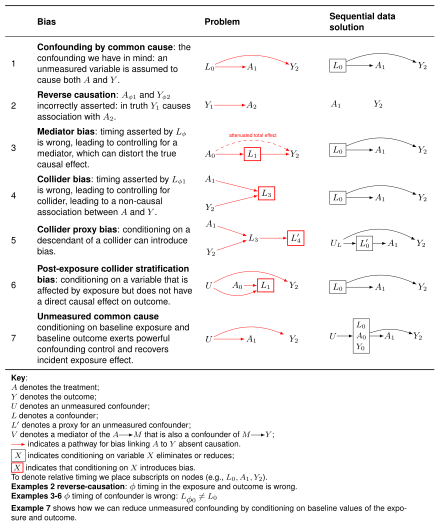
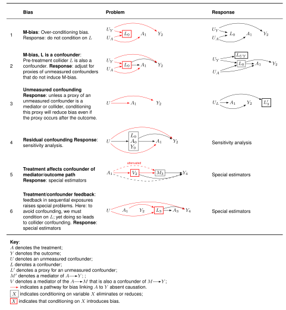
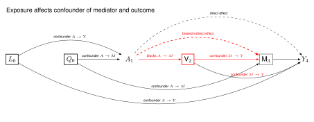

# Week 3: Causal Diagrams — The Structures of Confounding Bias

**Date:** 11 Mar 2026

```admonish note title="Readings"
**Required**

- Hernán MA, Robins JM (2024). *Causal Inference: What If.* Chapter 6. [link](https://www.dropbox.com/scl/fi/9hy6xw1g1o4yz94ip8cvd/hernanrobins_WhatIf_2jan24.pdf?rlkey=8eaw6lqhmes7ddepuriwk5xk9&dl=0)

**Optional**

- Suzuki E et al. (2020). Causal diagrams. [link](https://www.dropbox.com/scl/fi/4midxwr9ltg9oce02e0ss/suzuki-causal-diagrams.pdf?rlkey=uktzf3nurtgpbj8m4h0xz82dn&dl=0)
- Bulbulia JA (2023). A causal inference framework for cross-cultural research. [link](https://osf.io/preprints/psyarxiv/b23k7)
- Neal B (2020). *Introduction to Causal Inference.* Chapter 3.
```

```admonish warning title="Key concepts for the test(s)"
- **M-bias**
- **Regression**
- **Intercept**
- **Regression coefficient**
- **Model fit**
- **Why model fit is misleading for causality**
```

```admonish tip title="Download your lab R script"
1. Create a new `.R` file called `03-lab.R` with your name, contact, date, and a title such as "Regression and confounding bias."
2. Copy and paste the code chunks below during class.
3. Save in a clearly defined project directory.

You may also download the lab here: [Download the R script for Lab 03](https://raw.githubusercontent.com/go-bayes/psych-434-2025/refs/heads/main/laboratory/03-lab.R)
```

---

## Seminar

### Learning Outcomes

- You will learn how to use causal diagrams to evaluate the "no unmeasured confounding" assumption of causal inference.
- You will understand how time-series data collection may address common confounding problems.
- You will understand why time-series data collection is insufficient for addressing other common confounding problems.

### Confounding problems resolved by time-series data

The following figure presents the structural features of **seven** confounding problems. We shall discuss examples of each, and how longitudinal data collection resolves each problem.



### Confounding problems not resolved by time-series data alone

The next figure presents six examples of time-series data that are not resolved by longitudinal data collection. **Before seminar, consider why time-series data are insufficient to address confounding in each of the six scenarios described in this figure.**



### Worked Example: The Assumptions in Causal Mediation



---


---

Lab materials: [Lab 3: Regression and Confounding Bias](lab-03.md)
