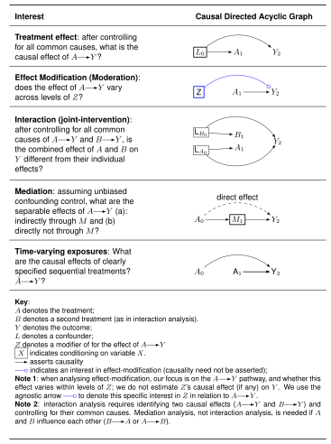
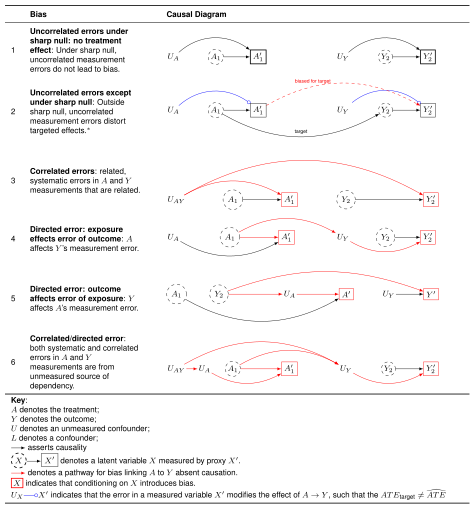
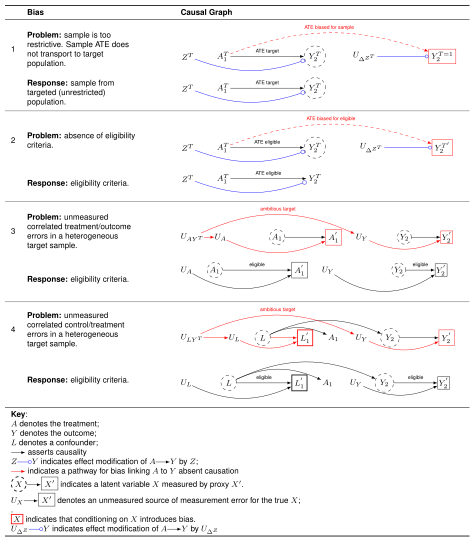

# Week 4: Interaction, Measurement Bias, and Selection Bias

```admonish note title="Readings"
**Required**

- Bulbulia (2023) "Methods in Causal Inference Part 1: Causal Diagrams and Confounding." [link](https://www.cambridge.org/core/journals/evolutionary-human-sciences/article/methods-in-causal-inference-part-1-causal-diagrams-and-confounding/E734F72109F1BE99836E268DF3AA0359)
- See [simplified reading](https://osf.io/preprints/psyarxiv/tbjx8_v1)

**Optional**

- Hernan & Robins (2024) *What If*, Chapters 6--9. [link](https://www.dropbox.com/scl/fi/9hy6xw1g1o4yz94ip8cvd/hernanrobins_WhatIf_2jan24.pdf?rlkey=8eaw6lqhmes7ddepuriwk5xk9&dl=0)
- Hernan (2004) "A Structural Approach to Selection Bias." [link](https://www.dropbox.com/scl/fi/qni0y1lstntmdw410m2nh/Heran2004StructuralSelectionBias.pdf?rlkey=0ob86mmx7vscxqmn3ipg9m94f&dl=0)
- Hernan (2017) "Selection Without Colliders." [link](https://www.dropbox.com/scl/fi/zr3tk7ngsutjprqr18bbg/hernan-selection-without-colliders.pdf?rlkey=vfluyl3a7zksfphqepao04fix&dl=0)
- Hernan & Cole (2009) "Causal Diagrams and Measurement Bias." [link](https://www.dropbox.com/scl/fi/ip8nil6uc5l0x9xw14mbr/hernan_cole_Measure_causal_diagrams.pdf?rlkey=wkj3ayen8xb6ncog46sps2g49&dl=0)
- VanderWeele & Hernan (2012) "Results on Differential and Dependent Measurement Error." [link](https://www.dropbox.com/scl/fi/wtqoibuyitdwm5nlpjuu7/vander_hernan_measurement_error_vanderweel.pdf?rlkey=e4znxaqdfzf2vg6sj4ui799bb&dl=0)
```

```admonish warning title="Key concepts for the test(s)"
- **Effect (measure) modification**
- **Undirected/uncorrelated measurement error bias**
- **Undirected/correlated measurement error bias**
- **Directed/uncorrelated measurement error bias**
- **Directed/correlated measurement error bias**
- **Selection bias and transportability**
```

```admonish tip title="Lab instructions"
For the lab, copy and paste code chunks following the "Lab 04" section.
```

---

## Seminar

### Learning outcomes

- You will learn the elementary structures of measurement error bias and be able to use them to explain how measurement can go wrong.
- You will begin to understand the relationship between structural sources of bias and measurement in cross-cultural studies.
- You will begin to understand how the concepts of target population and sample population clarify external validity and transportability of results in cross-cultural research.

### Common causal questions presented as causal graphs



### A typology of measurement error bias



### Threats to external validity



---

---

Lab materials: [Lab 4: Regression and Confounding Bias](lab-04.md)
