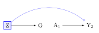
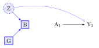

# Week 6: Effect Modification and CATE

*Date: 2 Apr 2026*

```admonish note title="Required Reading"
- Hernan and Robins (2024) *What If*, Chapters 4--5. [link](https://www.dropbox.com/scl/fi/9hy6xw1g1o4yz94ip8cvd/hernanrobins_WhatIf_2jan24.pdf?rlkey=8eaw6lqhmes7ddepuriwk5xk9&dl=0)

**Optional Reading**

- VanderWeele (2007) "Four types of effect modification." [link](https://www.dropbox.com/scl/fi/drytp2ui2b8o9jplh4bm9/four_types_of_effect_modification__a.6.pdf?rlkey=mb9nl599v93m6kyyo69iv5nz1&dl=0)
- VanderWeele (2009) "On the distinction between interaction and effect modification." [link](https://www.dropbox.com/scl/fi/srpynr0dvjcndveplcydn/OutcomeWide_StatisticalScience.pdf?rlkey=h4fv32oyjegdfl3jq9u1fifc3&dl=0)
```

```admonish important title="Key Concepts for Assessment"
- **Causal Estimand:** The specific causal question we want to answer (e.g., the average effect in the whole population).
- **Statistical Estimand:** The calculation we perform on our data to try and answer the causal question.
- **Interaction:** The combined effect of *two or more* interventions.
- **Effect Modification:** When the effect of *one* intervention changes depending on a person's characteristics.
- **Heterogeneous Treatment Effects (HTE):** The general *idea* that treatment effects vary across people.
- **Conditional Average Treatment Effect (CATE) $\tau(x)$:** The *average* treatment effect for a specific subgroup defined by characteristics $x$.
- **Estimated Conditional Average Treatment Effect $\hat{\tau}(X)$:** Our *estimate* (from data) of the average treatment effect for a subgroup with characteristics $X$.
```


## If you learn nothing else from this course...

To answer psychological questions properly, we first need to state them very clearly. Causal inference gives us the tools to do this.


## Causal inference asks: "What if?"

The core idea is to compare what *actually happened* with what *could have happened* under different conditions (these "what ifs" are called **counterfactuals**).

Imagine an outcome we care about, like student test scores ($Y$). We might compare the score if *everyone* got a new teaching method (let's call this condition $a^*$) versus if *everyone* got the old method (condition $a$).

The difference in the potential outcome ($Y$) under these two scenarios is the causal effect for one person: $Y(a^*) - Y(a)$.

Since we can't see both scenarios for the same person, we often look at the average effect across a group. The **Average Treatment Effect (ATE)** is the average difference in potential outcomes across the whole population:

$$
\text{ATE} = \mathbb{E}[Y(a^*) - Y(a)]
$$

This asks: "On average, how much would scores change if we switched everyone from the old method ($a$) to the new method ($a^*$)?".

A big challenge is dealing with **confounders**, other factors that mix up the relationship between the treatment ($A$) and the outcome ($Y$), potentially misleading us about the true causal effect. We need to account for these.


## What do 'Interaction' and 'Effect Modification' mean in Causal Inference?

Words like 'moderation' and 'interaction' are often used loosely. Causal inference needs precise terms.

We'll focus on two specific ideas:

1. **Interaction:** About the effect of *combining* interventions.
2. **Effect Modification:** About how the effect of *one* intervention changes for different *types of people*.


## Interaction: The Effect of Teamwork (or Lack Thereof)

**Interaction** in causal inference is about **joint interventions**. We look at what happens when we apply *two or more different treatments* at the same time.

Let's say we have two treatments, $A$ and $B$, and an outcome $Y$.

- $Y(\tilde{a})$ is the potential outcome if we set treatment $A$ to level $\tilde{a}$.
- $Y(\tilde{b})$ is the potential outcome if we set treatment $B$ to level $\tilde{b}$.
- $Y(\tilde{a}, \tilde{b})$ is the potential outcome if we set $A$ to $\tilde{a}$ *and* $B$ to $\tilde{b}$ simultaneously.

To figure out these effects from observational data, we usually need assumptions like:

- **Consistency:** The outcome we see for someone who got treatment $\tilde{a}$ is the same as their potential outcome $Y(\tilde{a})$.
- **Conditional Exchangeability (No Unmeasured Confounding):** We can make the groups receiving different treatments comparable by adjusting for measured confounders ($L$ for $A \to Y$, and $Q$ for $B \to Y$). The sets $L$ and $Q$ might overlap.
- **Positivity:** The exposures to be compared occur in all subgroups.

To study the *interaction* between $A$ and $B$, we need to be able to estimate the effect of $A$ and the effect of $B$, which means we need to adjust for *all* confounders in **both** $L$ and $Q$ (i.e., their union $L \cup Q$).


### Defining Interaction: Does 1 + 1 = 2?

Let's use an education example:

- $A$: New teaching method (1=New, 0=Old)
- $B$: Extra tutoring (1=Yes, 0=No)
- $Y$: Test score

Is the boost in scores from getting *both* the new method *and* tutoring simply the sum of the boost from *only* the new method and the boost from *only* tutoring?

We define **causal interaction on the additive scale** (looking at differences) by comparing the effect of the joint intervention to the sum of the individual effects (all compared to getting neither):

$$
\underbrace{(\mathbb{E}[Y(1,1)] - \mathbb{E}[Y(0,0)])}_{\text{Effect of Both}} \quad \text{vs} \quad \underbrace{(\mathbb{E}[Y(1,0)] - \mathbb{E}[Y(0,0)])}_{\text{Effect of A only}} + \underbrace{(\mathbb{E}[Y(0,1)] - \mathbb{E}[Y(0,0)])}_{\text{Effect of B only}}
$$

Interaction exists if these are not equal. This simplifies to checking if the following is non-zero (see Appendix A):

$$
\underbrace{\mathbb{E}[Y(1,1)]}_{\text{Both}} - \underbrace{\mathbb{E}[Y(1,0)]}_{\text{A only}} - \underbrace{\mathbb{E}[Y(0,1)]}_{\text{B only}} + \underbrace{\mathbb{E}[Y(0,0)]}_{\text{Neither}} \neq 0
$$

- If this is positive: **Synergy** (the combination is better than expected).
- If this is negative: **Antagonism** (the combination is worse than expected).

(We could also look at interaction on other scales, like ratios, which might give different answers. Always state the scale you're using; we'll come back to this in later lectures.)

#### Finding Causal Interaction in Data

To estimate this interaction, we need valid estimates for all four average potential outcomes:

$$\mathbb{E}[Y(0,0)], \mathbb{E}[Y(1,0)], \mathbb{E}[Y(0,1)], \mathbb{E}[Y(1,1)]$$

This means we must control for confounders of *both* the $A \to Y$ link and the $B \to Y$ link.

The following figure shows this. $L_A$ are confounders for $A \to Y$, and $L_B$ are confounders for $B \to Y$. We need to block the backdoor paths (red arrows).


The next figure shows we need to condition on (adjust for) *both* $L_A$ and $L_B$.


In our education example:

- **$L_A$ (Confounders for Teaching Method $\to$ Score):** Prior achievement, motivation, family background (SES), school quality, teacher differences (if not randomly assigned).
- **$L_B$ (Confounders for Tutoring $\to$ Score):** Prior achievement, motivation, family background (SES, paying for tutoring), student availability, specific learning needs.

Notice that prior achievement and motivation are in *both* $L_A$ and $L_B$. We need to measure and adjust for *all* important factors in $\boxed{L_A}$ and $\boxed{L_B}$ to get a reliable estimate for interaction.


## Effect Modification: Different Effects for Different People

Unlike interaction (about combining treatments), **effect modification** is about whether the causal effect of a *single* intervention ($A$) on an outcome ($Y$) is *different* for different subgroups in the population. These subgroups are defined by baseline characteristics (like age, sex, prior history; let's call these $G$ or $X$).

Effect modification helps us understand *who* benefits most (or least) from an intervention. We explore this using ideas like Heterogeneous Treatment Effects (HTE) and Conditional Average Treatment Effects (CATE).


### Heterogeneous Treatment Effects (HTE): The Idea of Variation

**Heterogeneous Treatment Effects (HTE)** just means that the effect of a treatment ($A$ on $Y$) isn't the same for everyone. The effect *varies*. This variation *is* effect modification.

Why does it vary?

- Differences in things we can measure (like age, sex, baseline health, our $X$ variables).
- Differences in things we can't easily measure (like genetics, unmeasured background factors).

HTE is the reality; treatments rarely work identically for all.


### Conditional Average Treatment Effect (CATE): Measuring Variation with Data $\tau(x)$

To study HTE using data, we focus on the **Conditional Average Treatment Effect (CATE)**. CATE is a specific *causal question (estimand)*: What is the average treatment effect *for the subgroup of people who share specific measured characteristics* $X=x$?

$$
\tau(x) = \text{CATE}(x) = \mathbb{E}[Y(1) - Y(0) | X = x]
$$

Here, $Y(1)$ is the potential outcome with treatment, $Y(0)$ without. $\tau(x)$ tells us the average effect specifically for people with characteristics $X=x$. By looking at how $\tau(x)$ changes for different $x$, we quantify effect modification *by the characteristics we measured in X*.


### Comparing Effects Across Defined Groups

A simple way to check for effect modification by a category $G$ (like comparing males vs females, or different locations) is to estimate the Average Treatment Effect (ATE) *separately within each group*. This is like comparing CATEs where $X$ is just the group variable $G$.

Let's say $A$ is the treatment (0=control, 1=treated) and $G$ is the potential modifier (e.g., $g=$female, $g'=$male).

We compare:

1. The average effect for females ($G=g_1$): $\delta_{g_1} = \mathbb{E}[Y(1) | G=g_1] - \mathbb{E}[Y(0) | G=g_1]$
2. The average effect for males ($G=g_2$): $\delta_{g_2} = \mathbb{E}[Y(1) | G=g_2] - \mathbb{E}[Y(0) | G=g_2]$

Effect modification by $G$ exists if these are different: $\gamma = \delta_{g_1} - \delta_{g_2} \neq 0$.

If our estimate $\hat{\gamma}$ is far from zero, it suggests the treatment effect differs between males and females.

#### Finding Effect Modification in Data

To estimate these group-specific effects ($\delta_g$) and their difference ($\gamma$) correctly, we need to control for confounders ($L$) of the $A \to Y$ relationship within each group defined by $G$. Note that we are not estimating the causal effect of $G$. As such, we do not need to control for things that cause $G$ itself, *unless* they also confound the $A \to Y$ relationship (i.e., are also in $L$).

Look at the following figure. To estimate the $A \to Y$ effect within levels of $G$, we need to adjust for the confounders $L_0$. However, this will partially block the effect-modification of $G$ on $Y$ because $L_0$ is a mediator for that path. Moreover, if we were identifying the causal effect of $G$ on $Y$, after conditioning on $L$, we would find that a backdoor path opens from $G \to Y$ because $\boxed{L}$ is a collider. $G$ does not have a causal interpretation in this model. However we would be wrong to think that $G$ is not an effect modifier of the effect of $A$ on $Y$. (See Appendix C.)


Thus it is essential to understand that when we control for confounding along the $A \to Y$ path, we do not identify the causal effects of effect-modifiers.

To clarify:

1. If the statistical model correctly identifies causal effect modification (by appropriately handling confounders and avoiding collider bias), then it has prognostic value regarding the differential outcomes expected under intervention $A=1$ vs $A=0$ depending on $G=g$.

2. If the statistical model contains interaction terms that are artefacts of bias (like conditioning on a collider) or reflect a different target (like conditioning on a mediator when the total effect was intended), its causal prognostic value is compromised or needs careful interpretation. It might still predict $Y$ well given $A$, $G$, and $L$ in an observational setting, but it wouldn't accurately predict the results of intervening on A differently for different $G$ groups. (See Appendix B.)

The choice of variables fundamentally determines which causal question (if any) the statistical model is estimating. As with the average treatment effect, we interpret evidence for effect modification in the context of our assumptions about the causal relationships that obtain in the world. This is because the statistical interaction we observe is highly sensitive to model choices. Any interpretation as causal effect modification, and therefore any reliable prognostic value for intervention effects within different segments of the population, depends entirely on whether and how our statistical model accounts for the causal structure.


## Estimating How Effects Vary: Getting $\hat{\tau}(x)$ from Data

We defined the Conditional Average Treatment Effect (CATE), $\tau(x)$, as the *true* average effect for a subgroup with specific features $X=x$:

$$
\tau(x) = \mathbb{E}[Y(1) - Y(0) | X = x]
$$

Now, we want to *estimate* this from our actual data. We call our estimate $\hat{\tau}(x)$. For any person $i$ in our study with features $X_i$, the value $\hat{\tau}(X_i)$ is our data-based *prediction* of the average treatment effect *for people like person i*.

### "Personalised" Effects vs. True Individual Effects

Wait: didn't we say we *can't* know the true effect for one specific person, $Y_i(1) - Y_i(0)$? Yes, that's still true.

So what does $\hat{\tau}(X_i)$ mean?

- **Individual Causal Effect (Unknowable):** $Y_i(1) - Y_i(0)$. This is the true effect for person $i$. We can't observe both $Y_i(1)$ and $Y_i(0)$.
- **Estimated CATE ($\hat{\tau}(X_i)$) (What we calculate):** This is our estimate of the *average* effect, $\mathbb{E}[Y(1) - Y(0)]$, for the *subgroup* of people who share the same measured characteristics $X_i$ as person $i$.

When people talk about "personalised" or "individualised" treatment effects in this context, they usually mean $\hat{\tau}(x)$. It's "personalised" because the prediction uses person $i$'s specific characteristics $X_i = x$. But remember, it's an **estimated average effect for a group**, not the unique effect for that single individual.

### People Have Many Characteristics

People aren't just in one group; they have many features at once. A student might be:

- Female
- 21 years old
- From a low-income family
- Did well on previous tests
- Goes to a rural school
- Highly motivated

All these factors ($X_i$) together might influence how they respond to a new teaching method.

Trying to figure this out with traditional regression by manually adding interaction terms (like `A*gender*age*income*...`) becomes impossible very quickly:

- Too many combinations, not enough data in each specific combo.
- High risk of finding "effects" just by chance (false positives).
- Hard to know which interactions to even include.
- Can't easily discover unexpected patterns.

Thus, while simple linear regression with interaction terms (`lm(Y ~ A * X1 + A * X2)`) can estimate CATEs if the model is simple and correct, it often fails when things get complex (many $X$ variables, non-linear effects).

**Causal forests** (using the `grf` package in R; Athey, Tibshirani, and Wager, 2024) are a powerful, flexible alternative designed for this task. They build decision trees that specifically aim to find groups with different treatment effects.

We'll learn how to use `grf` after the mid-term break. It will allow us to get the $\hat{\tau}(x)$ predictions and then think about how to use them, for instance, to prioritise who gets a treatment if resources are limited.


## Summary

Let's revisit the core concepts.

**Interaction:**

- **Think:** Teamwork effect.
- **What:** Effect of *two or more different interventions* ($A$ and $B$) applied together.
- **Question:** Is the joint effect $\mathbb{E}[Y(a,b)]$ different from the sum of individual effects?
- **Needs:** Control confounders for *all* interventions involved ($L \cup Q$).

**Effect Modification / HTE / CATE:**

- **Think:** Different effects for different groups.
- **What:** Effect of a *single intervention* ($A$) varies depending on people's *baseline characteristics* ($G$ or $X$).
- **Question (HTE):** *Does* the effect vary? (The phenomenon.)
- **Question (CATE $\tau(x)$):** *What is* the average effect for a specific subgroup with features $X=x$? (The measure.)
- **Needs:** Control confounders for the *single* intervention ($L$) within subgroups.

**Estimated "Individualised" Treatment Effects ($\hat{\tau}(x)$):**

- **Think:** Personal profile prediction.
- **What:** Our *estimate* of the average treatment effect for the subgroup of people sharing characteristics $X_i$.
- **How:** Calculated using models (like causal forests) that use the person's full profile $X_i$.
- **Important:** This is **not** the true effect for that single person (which is unknowable). It's an average for *people like them*.
- **Use:** Explore HTE, identify subgroups, potentially inform targeted treatment strategies.

Keeping these concepts distinct helps us ask clear research questions and choose the right methods.


## Course Review So Far: A Quick Recap

Let's quickly review the main ideas of causal inference we've covered.

### The Big Question: Does A cause Y?

Causal inference helps us answer if something (like a teaching method, $A$) causes a change in something else (like test scores, $Y$).

### Core Idea: "What If?" (Counterfactuals)

We compare what actually happened to what *would have happened* in a different scenario.

- $Y(1)$: Score if the student *had* received the new method.
- $Y(0)$: Score if the student *had* received the old method.

The **Average Treatment Effect (ATE)** = $\mathbb{E}[Y(1) - Y(0)]$ is the average difference across the whole group.

### This Lecture Clarified Concepts of Interaction vs. Effect Modification vs. Individual Predictions

**Interaction (Think: Teamwork Effects)**

- **About:** Combining *two different interventions* (A and B).
- **Question:** Does using both A and B together give a result different from just adding up their separate effects? (e.g., new teaching method + tutoring).
- **Needs:** Analyse effects of A alone, B alone, and A+B together. Control confounders for *both* A and B.

**Effect Modification (Think: Different Effects for Different Groups)**

- **About:** How the effect of *one intervention* (A) changes based on people's *characteristics* (X, like prior grades).
- **Question:** Does the teaching method (A) work better for high-achieving students (X=high) than low-achieving students (X=low)?
  - **HTE:** The *idea* that effects differ.
  - **CATE $\tau(x)$:** The *average effect* for the specific group with characteristics $X=x$.
- **Needs:** Analyse effect of A *within* different groups (levels of X). Control confounders for A.

**Estimated Individualised Effects ($\hat{\tau}(X_i)$) (Think: Personal Profile Prediction)**

- **About:** Using a person's *whole profile* of characteristics ($X_i$, age, gender, background, etc.) to predict their probable response to treatment A.
- **How:** Modern methods (like causal forests) take all of $X_i$ and estimate $\hat{\tau}(X_i)$.
- **Result:** this $\hat{\tau}(X_i)$ is **not** the true unknowable effect for person $i$. It is the estimated *average effect for people similar to person i* (sharing characteristics $X_i$).
- **Use:** helps explore if tailoring treatment based on these profiles ($X_i$) could be beneficial.

### Simple Summary

- **Interaction:** Do A and B work together well/badly?
- **Effect Modification:** Does A's effect depend on *who* you are (based on X)?
- **$\hat{\tau}(X_i)$:** Can we *predict* A's average effect for someone based on their specific profile $X_i$?

Understanding these differences is key to doing good causal research.


## Lab Part 1: Setting up your data

### Set up your libraries

```r
library("margot")
library("tidyverse")
library("ggplot2")
library("here")
library("skimr")
if (!require(gtsummary)) install.packages("gtsummary")
if (!require(janitor)) install.packages("janitor")

# if you need to update the margot package, uncomment and do this
# devtools::install_github("go-bayes/margot")
```

### Set up a path to a folder in your directory

This will allow you to save the outputs of models and other information, which will be handy when you are producing your manuscript. Call this `push_mods`.

```r
# create a folder called saved and make a path like this
push_mods <- here::here("saved")

# view it (will be different for you)
push_mods

# another option
# saveRDS(object, here::here(push_mods, "object"))
```

### Initial Data Wrangling to select the study sample

#### Where to find variable names information

Find it in the data directory here: <https://osf.io/75snb/>

Also see here: <https://github.com/go-bayes/templates/tree/main/method>

#### Think: what are my eligibility criteria?

- Participated at baseline
- Participated at treatment wave
- May have been lost to follow up at the end of the study
- Full information on the treatment variable (think about this...)

```r
library(margot)
library(tidyverse)
library(table1)
library(gtsummary)

# eliminate haven labels
df_nz <- as.data.frame(df_nz)
df_nz <- haven::zap_formats(df_nz)
df_nz <- haven::zap_label(df_nz)
df_nz <- haven::zap_widths(df_nz)

# name output folder
push_mods <- here::here("outputs")

# set exposure name
name_exposure <- "perfectionism"

# obtain ids for individuals who participated in 2018
# and have no missing baseline exposure
ids_2018 <- df_nz |>
  dplyr::filter(year_measured == 1, wave == 2018) |>
  dplyr::filter(!is.na(!!sym(name_exposure))) |>
  pull(id)

# obtain ids for individuals who participated in 2019
ids_2019 <- df_nz |>
  dplyr::filter(year_measured == 1, wave == 2019) |>
  dplyr::filter(!is.na(!!sym(name_exposure))) |>
  pull(id)

# intersect IDs from 2018 and 2019 to ensure participation in both years
ids_2018_2019 <- intersect(ids_2018, ids_2019)

# data wrangling
dat_long <- df_nz |>
  dplyr::filter(id %in% ids_2018_2019 &
                  wave %in% c(2018, 2019, 2020)) |>
  arrange(id, wave) |>
  select(
    "id",
    "wave",
    "year_measured",
    "age",
    "male",
    "born_nz",
    "eth_cat",
    "employed",
    "edu",
    "household_inc",
    "partner",
    "parent",
    "alert_level_combined_lead",
    "political_conservative",
    "hours_exercise",
    "agreeableness",
    "conscientiousness",
    "extraversion",
    "honesty_humility",
    "openness",
    "neuroticism",
    "modesty",
    "sample_weights",
    "neighbourhood_community",
    "belong",
    "rural_gch_2018_l",
    "support",
    "perfectionism",
    "religion_religious",
    "kessler_latent_depression",
    "kessler_latent_anxiety"
  ) |>
  mutate(
    # initialise 'censored'
    censored = ifelse(lead(year_measured) == 1, 1, 0),
    # modify 'censored' based on the condition
    censored = ifelse(is.na(censored) &
                        year_measured == 1, 1, censored)
  ) |>
  select(-year_measured) |>
  dplyr::mutate(
    # rescale these variables to get all variables on a similar scale
    # otherwise your models can blow up, or become uninterpretable
    household_inc_log = log(household_inc + 1),
    hours_exercise_log = log(hours_exercise + 1)
  ) |>
  dplyr::select(
    -c(
      household_inc,
      hours_exercise)
  ) |>
  droplevels() |>
  arrange(id, wave) |>
  mutate(
    rural_gch_2018_l = as.numeric(as.character(rural_gch_2018_l)),
    partner = as.numeric(as.character(partner)),
    born_nz = as.numeric(as.character(born_nz)),
    censored = as.numeric(as.character(censored)),
    employed = as.numeric(as.character(employed))
  ) |>
  droplevels() |>
  data.frame() |>
  droplevels() |>
  arrange(id, wave) |>
  data.frame()

# check n in this sample
n_participants <- skimr::n_unique(dat_long$id)

# make number pretty
n_participants <- prettyNum(n_participants, big.mark = ",")

# save this so that you can use it in your manuscript
margot::here_save(n_participants, "n_participants")

# try reading
n_participants_did_it_work_question_mark <- margot::here_read("n_participants")
```

### Define your baseline covariates, treatment (exposure), and outcome

```r
# for example
baseline_vars <- c(
  "age", "male", "edu", "eth_cat", "partner", "employed",
  "born_nz", "neighbourhood_community", "household_inc_log",
  "parent", "religion_religious", "rural_gch_2018_l",
  "sample_weights", "employed", "alert_level_combined_lead"
)

# treatment
exposure_var <- c("perfectionism", "censored")

# outcome, can be many
outcome_vars <- c("kessler_latent_anxiety", "kessler_latent_depression")

# define waves
baseline_wave <- "2018"

# exposure waves
exposure_waves <- c("2018", "2019")

# outcome wave
outcome_wave <- "2020"

# exposure
name_exposure <- "perfectionism"
```

### Make your baseline table

```r
tables <- margot::margot_summary_tables(
  dat_long,
  exposure_waves = exposure_waves,
  baseline_wave = baseline_wave,
  outcome_wave = outcome_wave,
  name_exposure = name_exposure,
  baseline_vars = baseline_vars,
  outcome_vars = outcome_vars
)
```

#### Baseline table

```r
tables$baseline_table
```

#### Exposure table

```r
# tables$exposure_tables
```

#### Outcome table

```r
tables$outcome_table
```

### Inspect the distribution of the exposure in treatment wave

```r
# select 2019 wave
dt_19 <- dat_long |> dplyr::filter(wave == 2019)

# mean
mean_exposure <- mean(dt_19$perfectionism, na.rm = TRUE)

# median
median_exposure <- median(dt_19$perfectionism, na.rm = TRUE)

# generate bar plot
graph_density_of_exposure_up <- margot::margot_plot_shift(
  dt_19,
  shift = "up",
  col_name = "perfectionism",
  binwidth = .25,
  range_highlight = c(0, mean_exposure)
)

# show
graph_density_of_exposure_up
```

### Check for change in the treatment (Positivity)

```r
# select data from wave 18 and 19
dt_18_19_positivity <- dat_long |>
  dplyr::filter(wave == 2018 | wave == 2019) |>
  dplyr::mutate(perfectionism_round = round(perfectionism, digits = 0)) |>
  dplyr::select(perfectionism_round, id, wave) |>
  droplevels()

out <- margot::margot_transition_table(
  data = dt_18_19_positivity,
  state_var = "perfectionism_round",
  id_var = "id",
  wave_var = "wave"
)

# table
out$tables[[1]]
```

#### Explanation for the table

```r
cat(out$explanation)
```


## Lab Part 2: Simulation to Clarify Why the Distribution of Effect Modifiers Matters for Estimating Treatment Effects

First, we load the `stdReg` library, which obtains marginal effect estimates by simulating counterfactuals under different levels of treatment (Sjolander, 2016). If a treatment is continuous, the levels can be specified.

We also load the `parameters` library, which creates nice tables (Ludecke et al., 2020).

```r
# to obtain marginal effects
library(stdReg)
# to create nice tables
library(parameters)
```

Next, we write a function to simulate data for the sample and target populations.

We assume the treatment effect is the same in the sample and target population. We assume that the coefficient for the effect-modifier and the coefficient for interaction are the same. We assume no unmeasured confounding throughout the study. We assume only selective attrition of one effect modifier such that the baseline population differs from the sample population at the end of the study.

That is: **the distribution of effect modifiers is the only respect in which the sample will differ from the target population.**

This function will generate data under a range of scenarios.

```r
# function to generate data for the sample and population,
# along with precise sample weights for the population, there are differences
# in the distribution of the true effect modifier but no differences in the
# treatment effect or the effect modification. all that differs between the
# sample and the population is the distribution of effect-modifiers.

# reproducibility
set.seed(123)

# simulate the data -- you can use different parameters
data <- margot::simulate_ate_data_with_weights(
  n_sample = 10000,
  n_population = 100000,
  p_z_sample = 0.1,
  p_z_population = 0.5,
  beta_a = 1,
  beta_z = 2.5,
  noise_sd = 0.5
)

# view
str(data)
```

We have generated both sample and population data. Next, we verify that the distributions of effect modifiers differ in the sample and in the target population:

```r
# obtain the generated data
sample_data <- data$sample_data
population_data <- data$population_data

# check imbalance
table(sample_data$z_sample)         # type 1 is rare
table(population_data$z_population) # type 1 is common
```

Good, the distributions differ. The simulation is working as intended.

Next, consider the question: "What are the differences in the coefficients that we obtain from the study population at the end of study, as compared with the target population?"

First, we obtain the coefficients for the sample:

```r
# model coefficients sample
model_sample <- glm(y_sample ~ a_sample * z_sample, data = sample_data)

# summary
parameters::model_parameters(model_sample, ci_method = "wald")
```

Now let's obtain the coefficients for the weighted regression of the sample. Notice that the coefficients are virtually the same:

```r
# model the sample weighted to the population
model_weighted_sample <- glm(
  y_sample ~ a_sample * z_sample,
  data = sample_data,
  weights = weights
)

# summary
summary(parameters::model_parameters(model_weighted_sample, ci_method = "wald"))
```

We might be tempted to infer that weighting wasn't relevant to the analysis. However, we'll see that such an interpretation would be a mistake.

Next, let us obtain model coefficients for the population. Note again there is no difference, only narrower errors owing to the large sample size.

```r
# model coefficients population
model_population <- glm(
  y_population ~ a_population * z_population,
  data = population_data
)

parameters::model_parameters(model_population, ci_method = "wald")
```

Again, there is no difference. All model coefficients are practically equivalent. The different distribution of effect modifiers does not result in different coefficient values for the treatment effect, the effect-modifier "effect," or the interaction of effect modifier and treatment.

Consider why this is the case: in a large sample where the causal effects are invariant (as we have simulated them to be), we will have good replication in the effect modifiers within the sample, so our statistical model can recover the *coefficients* for the population without difficulty.

However, **in causal inference, we are interested in obtaining the marginal effect of the treatment**. That is, we seek an estimate for the counterfactual contrast in which everyone in a pre-specified population was subject to one level of treatment compared with a counterfactual condition in which everyone in a population was subject to another level of the same treatment. **When the sample population differs in the distribution of effect modifiers from the target population effect, the marginal effect estimates will typically differ.**

To see this, we use the `stdReg` package to recover marginal effect estimates, comparing (1) the sample ATE, (2) the true oracle ATE for the population, and (3) the weighted sample ATE. We will use the outputs of the same models above. The only difference is that we will calculate marginal effects from these outputs. We will contrast a difference from an intervention in which everyone receives treatment = 0 with one in which everyone receives treatment = 1; however, this choice is arbitrary, and the general lessons apply irrespective of the estimand.

First, consider the ATE for the sample population.

```r
# regression standardisation
library(stdReg)

# obtain sample ate
fit_std_sample <- stdReg::stdGlm(
  model_sample,
  data = sample_data,
  X = "a_sample"
)

# summary
summary(fit_std_sample, contrast = "difference", reference = 0)
```

The treatment effect is given as a 1.06 unit change in the outcome across the sample population, with a confidence interval from 1.04 to 1.08.

Next, we obtain the true (oracle) treatment effect for the population under the same intervention.

```r
# obtain true ate
fit_std_population <- stdReg::stdGlm(
  model_population,
  data = population_data,
  X = "a_population"
)

# summary
summary(fit_std_population, contrast = "difference", reference = 0)
```

Note: the true treatment effect is a 1.25 unit change in the population, with a confidence bound between 1.24 and 1.26. This is well outside the ATE that we obtain from the sample population.

Next, consider the ATE in the weighted regression, where the sample was weighted to the target population's true distribution of effect modifiers.

```r
# weighted ate where we correctly assign population weights to the sample
fit_std_weighted_sample_weights <- stdReg::stdGlm(
  model_weighted_sample,
  data = sample_data,
  X = "a_sample"
)

# this gives us the right answer
summary(fit_std_weighted_sample_weights, contrast = "difference", reference = 0)
```

We find that we obtain the population-level causal effect estimate with accurate coverage by weighting the sample to the target population. So with appropriate weights, our results generalise from the sample to the target population.


## Lessons from Lab 2

Regression coefficients do not clarify the problem of sample/target population mismatch, or selection bias as discussed here. The correct advice to investigators is that they should not rely on regression coefficients when evaluating the biases that arise from sample attrition. This advice applies to both methods that the authors use to investigate threats of bias. That is, to implement this advice, the authors must first take it.

Generally, observed data are insufficient for assessing threats. Observed data do not clarify structural sources of bias, nor do they clarify effect-modification across the full counterfactual data conditions, in which (1) all receive the treatment and (2) all do not receive the treatment (at the same level). To properly assess bias, one would need access to the counterfactual outcome, what would have happened to the missing participants had they not been lost to follow-up or had they responded. Again, the joint distributions over "full data" are inherently unobservable (van der Laan, 2011).

In simple settings like the one we just simulated, we may address the gap between the sample and target population using methods such as modelling the censoring (e.g., censoring weighting). However, we never know what setting we are in or whether it is simple; such modelling must be handled with care. There is a large and growing epidemiology literature on this topic (see, for example, Li et al., 2023).


## Appendix A: Simplification of Additive Interaction Formula

We start with the definition of additive interaction based on comparing the joint effect relative to baseline versus the sum of individual effects relative to baseline:

$$
\Big(\mathbb{E}[Y(1,1)] - \mathbb{E}[Y(0,0)]\Big) - \Big[\Big(\mathbb{E}[Y(1,0)] - \mathbb{E}[Y(0,0)]\Big) + \Big(\mathbb{E}[Y(0,1)] - \mathbb{E}[Y(0,0)]\Big)\Big]
$$

First, distribute the negative sign across the terms within the square brackets:

$$
\mathbb{E}[Y(1,1)] - \mathbb{E}[Y(0,0)] - \Big(\mathbb{E}[Y(1,0)] - \mathbb{E}[Y(0,0)]\Big) - \Big(\mathbb{E}[Y(0,1)] - \mathbb{E}[Y(0,0)]\Big)
$$

Now remove the parentheses, flipping the signs inside them where preceded by a minus sign:

$$
\mathbb{E}[Y(1,1)] - \mathbb{E}[Y(0,0)] - \mathbb{E}[Y(1,0)] + \mathbb{E}[Y(0,0)] - \mathbb{E}[Y(0,1)] + \mathbb{E}[Y(0,0)]
$$

Next, combine the $\mathbb{E}[Y(0,0)]$ terms:

- We have $-\mathbb{E}[Y(0,0)]$
- Then $+\mathbb{E}[Y(0,0)]$ (these two cancel each other out)
- And another $+\mathbb{E}[Y(0,0)]$ remains.

The expression simplifies to:

$$
\mathbb{E}[Y(1,1)] - \mathbb{E}[Y(1,0)] - \mathbb{E}[Y(0,1)] + \mathbb{E}[Y(0,0)]
$$

This is the standard definition of additive interaction, often called the interaction contrast. If this expression equals zero, there is no additive interaction; a non-zero value indicates an interaction effect.

**This shows clearly that interaction is the deviation of the joint effect from the sum of the separate effects, adjusted for the baseline.**


## Appendix B: Evidence for Effect-Modification is Relative to Inclusion of Other Variables in the Model

The 'sharp-null hypothesis' states there is no effect of the exposure on the outcome for any unit in the target population. Unless the sharp-null hypothesis is false, there may be effect-modification. For any study worth conducting, we cannot evaluate whether the sharp-null hypothesis is false. If we could, the experiment would be otiose. Therefore, we must assume the possibility of effect-modification. Whether a variable is an effect-modifier also depends on which other variables are included in the model. That is, just as for the concept of a 'confounder', where a variable is an 'effect-modifier' cannot be stated without reference to an assumed causal order and an explicit statement about which other variables will be included in the model (VanderWeele, 2012).

As illustrated in the following figure, the marginal association between $A$ and $Y$ is unbiased. Here, exposure $A$ is unconditionally associated with $Y$. We use the convention that a solid blue box (e.g., $\boxed{G}$) denotes effect-modification with conditioning and a dashed blue circle (e.g., Z in a dashed circle) indicates effect-modification without conditioning.


The next figure presents the same randomised experiment as in the previous causal diagram. We again assume that there is no confounding of the marginal association between the exposure, $A$, and the outcome, $Y$. However, suppose we were to adjust for $Z$ and ask: does the conditional association of $A$ on $Y$ vary within levels of $G$, after adjusting for $Z$? That is, does $G$ remain an effect-modifier of the exposure on the outcome? VanderWeele (2007) proved that for effect-modification to occur, at least one other arrow besides the treatment must enter into the outcome. According to the diagram, the only arrow into $Y$ other than $A$ arrives from $Z$. Because $Y$ is independent of $G$ conditional on $Z$, we may infer that $G$ is no longer an effect modifier for the effect of $A$ on $Y$. Viewed another way, $G$ no longer co-varies with $Y$ conditional on $Z$ and so cannot act as an effect-modifier.



The following figure presents the same randomised experiment as in the previous graph. We assume a true effect of $A \rightarrow Y$. If we do not condition on $B$, then $G$ will not modify the effect of $A \rightarrow Y$ because $G$ will not be associated with $Y$. However, if we were to condition on $B$, then both $B$ (an effect modifier by proxy) and $G$ may become effect-modifiers for the causal effect of $A$ on $Y$. In this setting, both $B$ and $G$ are conditional effect-modifiers.

Note that causal graphs help us to evaluate classifications of conditional and unconditional effect modifiers. They may also help to clarify conditions in which conditioning on unconditional effect-modifiers may remove conditional effect-modification. However, we cannot tell from a causal diagram whether the ancestors of an unconditional effect-modifier will be conditional effect-modifiers for the effect of the exposure on the outcome; see VanderWeele (2007), also Suzuki et al. (2013). Causal diagrams express non-parametric relations. I have adopted an off-label colouring convention to denote instances of effect-modification to highlight possible pathways for effect-modification, which may be relative to other variables in a model.



The next figure reveals the relativity of effect-modification. If investigators do not condition on $B$, then $G$ cannot be a conditional effect-modifier because $G$ would then be independent of $Z$ because $B$ is a collider. However, as we observed in the previous figure, conditioning on $B$ (a collider) may open a path for effect-modification of $G$ by $Z$. Both $B$ and $G$ are conditional effect modifiers.


The final figure considers the implications of conditioning on $Z$, which is the only unconditional effect-modifier on the graph. If $Z$ is measured, conditioning on $Z$ will remove effect-modification for $B$ and $G$ because $B, G \perp\!\!\!\perp Y | Z$. This example again reveals the context dependency of effect-modification. Here, causal diagrams are useful for clarifying features of dependent and independent effect modification. For further discussion, see Suzuki et al. (2013) and VanderWeele (2009).


## Appendix C: Further Clarification on Effect Modification Without Statistical Evidence for It

Again, look at the effect modification DAG from the seminar. Suppose the investigator models the effect of $A$ on $Y$. Suppose $G$ is not associated with $Y$ conditional on $L$. The DAG provides structural clarification for why concluding there is no effect modification by $G$ is incorrect.

To clarify:

- We have a DAG structure: $G \to L$; $L \to A$, $L \to Y$
- We're interested in the conditional average treatment effect (CATE): $\tau(g) = E[Y(1) - Y(0) | G = g]$
- To identify the effect of $A$ on $Y$, we must condition on $\boxed{L}$
- $G$ is (partially or fully) d-separated from $Y$ conditional on $\boxed{L}$

Even though $G$ is d-separated from $Y$ given $L$, this doesn't mean $G$ can't modify the effect of $A$ on $Y$. The CATE for a specific value of $G$ can be expressed as:

$$\tau(g) = E[Y(1) - Y(0) | G = g] = E[E[Y(1) - Y(0) | L, G = g] | G = g]$$

Since $G$ is d-separated from $Y$ given $L$:

$$\tau(g) = E[E[Y(1) - Y(0) | L] | G = g]$$

This means $\tau(g)$ is a weighted average of the L-specific treatment effects, where the weights are determined by the distribution of L given $G=g$.

If two conditions are met:

1. The effect of $A$ on $Y$ varies across levels of $L$
2. The distribution of $L$ varies with $G$ (which it does, since $G \to L$)

Then $\tau(g)$ will vary with $g$, indicating effect modification by $G$.

The investigators would be wrong to equate d-separation with absence of effect modification. Although $G$ doesn't directly affect $Y$ after conditioning on $L$, $G$ can still modify the effect of $A$ on $Y$ through its influence on the distribution of $L$.
